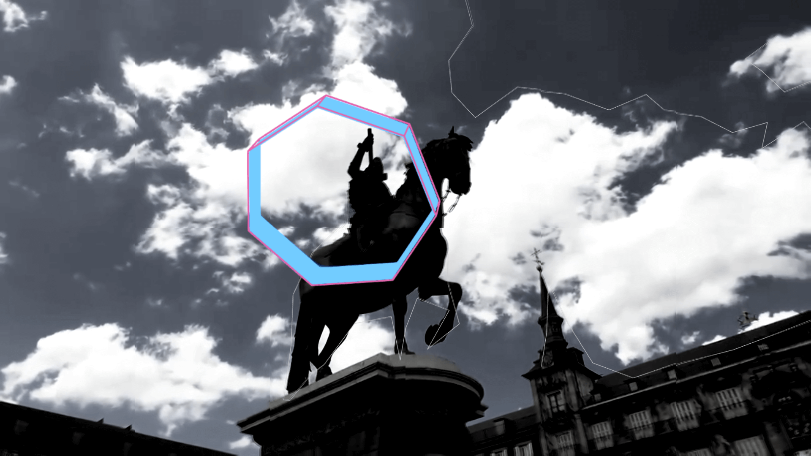

# Madrid Realtime Object Detection 🇪🇸
## Project done for a TouchDesigner workshop "URBAN-DX : Real-time Urban Digital eXploration"

Demo: https://vimeo.com/436011202  

Done with a custom ML app communicating TouchDesigner project that interpolate data in realtime.
All the datas are shared between the processes by
- Spout for texture sharing (tnx to [Spiral Technica](https://github.com/spiraltechnica) for makin it possible)
- OSC for data analysis results 

This project is intended for study purpose and is deeply chained to my own ML app. Could be complex to make it working with a different app but not impossible :)

In order to work in an other environment the main points are:
- add a new footage to the movie_file_in
- use spout communication for communicating analyzed textures
- update the osc bundle structure for custom msgs
- free time 👨‍💻🤯☕️☕️☕️☕️☕️☕️☕️☕️☕️

  
Based on 
- [Darknet](https://pjreddie.com/darknet)
- [YOLO v3](https://pjreddie.com/darknet/yolo/)
- [PyOpenGL](http://pyopengl.sourceforge.net/)
- [Spout-for-Python](https://github.com/spiraltechnica/Spout-for-Python)
